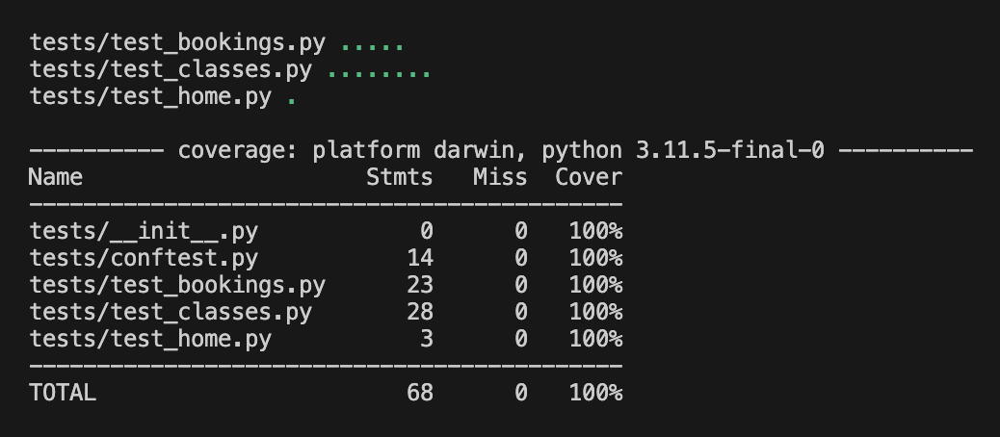
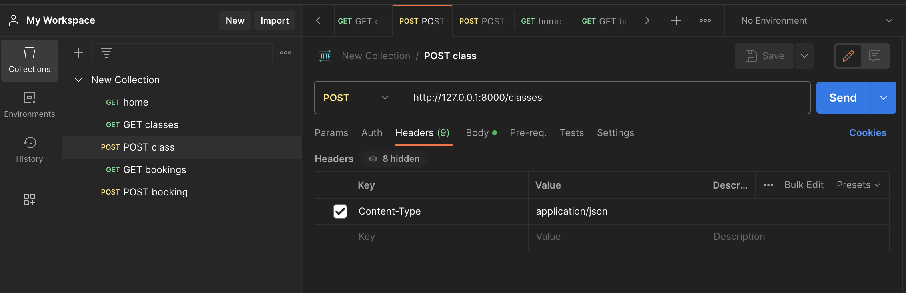
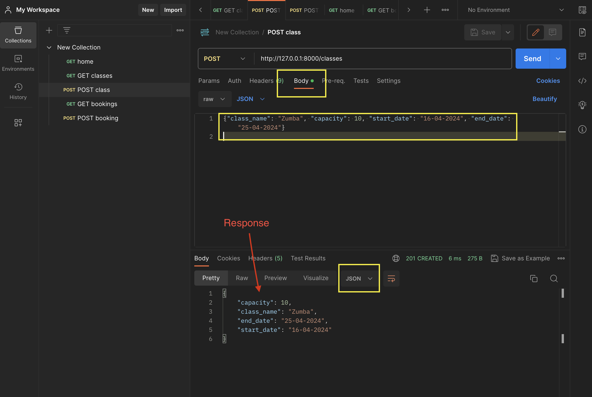

# classes-api
Fitness studio API to create classes and manage bookings.

Table of content:

1. [User stories](#user-stories)
2. [Project planning](#project-planning)
3. [Local deployment](#local-deployment)
4. [Testing](#testing)

## User Stories

1. Story - Create classes
    
    As a __studio owner__ i want to __create classes__ for my studio so that my members can attend classes

    Acceptance Criteria
    - Implement an API to create classes(`/classes`). Assume this api doesn't need to have any
    authentication to start with.
    - Few bare minimum details we need to create classes are - class name, start_date, end_date,
    capacity. For now, assume that there will be only one class per given day. Ex: If a class by
    name pilates starts on 1st Dec and ends on 20th Dec, with capacity 10, that means Pilates
    has 20 classes and for each class the maximum capacity of attendance is 10.
    - No need to save the details in any database. Maintain an in memory array or a file to save the
    info. (If you want to use the database, that's fine as well).
    - Use Restful standards and create the api endpoint with proper success and error responses.
    
2. Story - Book for a class

    As a __member of a studio__, I can __book for a class__, so that I can attend a class.
    
    Acceptance Criteria
    - Implement an API endpoint (`/bookings`). Assume this api doesn't need to have any
    authentication to start with.
    - Few bare minimum details we need for reserving a class are - name(name of the member
    who is booking the class), date(date for which the member wants to book a class)
    - No need to save the details in DB. If you can maintain the state in an in memory array or a file
    is good to start with. But no constraints if you want to use a database to save the state.
    - Use REST standards and think through basic api responses for success and failure.
    - No need to consider the scenario of overbooking for a given date. Ex: 14th Dec having a
    capacity of 20 , but the number of bookings can be greater than 20.

## Project Planning

### Models

1. __Class__
    - id - Integer, PrimaryKey
    - class_name - String, Required
    - capacity - Integer, Required
    - start_date - Date, Required
    - end_date - Date, Required

    Note: The id would ideally be automatically assigned, but for this task we will enter it manually

2. __Booking__
    - id - Integer, PrimaryKey
    - client_name - String, Required
    - date - Date, Required

### Directory Structure

- __main.py__ - contains the endpoints and the main logic
- __validation.py__ - contains the logic to validate if the data submitted is valid

- __data.py__ - Contains the logic to retrieve and write data
- __data.json__ - For semplicity we use a json file to store the data

- __tests folder__ - Contains the test files
- __test_data.json__ - Is the json file used from tests to store data

### Endpoints

1. Classes

    Methods:
    - GET   /classes - Returns all classes
    - POST  /classes - Creates new class

2. Bookings

    Methods:
    - GET  /bookings - Returns all bookings
    - POST  /bookings - Creates new bookings

Note: For the purpose of this task the PUT and DELETE method were not implemented.

## Local deployment

### 1. Clone the repo

1. From the terminal navigare to the folder where you want to clone the repository

2. Run the following command:

        git clone https://github.com/EliSacch/classes-api.git

### 2. Make sure python and pip are installed

In the retminal, run the following commands:

#### Python:
        // Windows
        python

        // Mac or Linux
        python3

If it is installed you will see a response which will include the version number.

Check the [official documentation](https://wiki.python.org/moin/BeginnersGuide/Download)

#### pip

Usually, pip is automatically installed if Python was downloaded from python.org

To check if pip is installed, run the following command:

        pip --version

Check the [official documentation](https://pypi.org/project/pip/)

### 3. Create and activate virtual environment (reccommended)

The virtualenv package is required to create virtual environments.

- To install the virtualenv package:

        pip install virtualenv

- To create a virtual environment:

        python -m venv venv
        
        or
        
        python3 -m venv venv

- To activate the virtual environment

        // Windows
        . venv\Scripts\activate

        or

        . venv\Scripts\activate.bin

        // Mac
        source venv/bin/activate

- To deactivate the virtual environment

        deactivate

See [official documentation](https://docs.python.org/3/library/venv.html#how-venvs-work)

### 4. Install dependencies from requirements.txt

In the terminal run the following code

        pip install -r requirements.txt

This will install all packages required to run this project, from the requirements.txt file.

Required packages:

- [Flask](https://pypi.org/project/Flask/)
- [requests](https://pypi.org/project/requests/)
- [dateutil](https://pypi.org/project/python-dateutil/)
- [pytest](https://docs.pytest.org/en/7.4.x/getting-started.html)

Optional:

- [pytest-cov](https://pypi.org/project/pytest-cov/) to check coverage

### 5. Run the app

In the terminal run the following code

        python main.py

The app runs on localhost:

Home: [http://127.0.0.1:8000](http://127.0.0.1:8000)

Classes: [http://127.0.0.1:8000/classes](http://127.0.0.1:8000/classes)

Bookings: [http://127.0.0.1:8000/bookings](http://127.0.0.1:8000/bookings)

## Testing

### Automated testing

In the terminal run the following command to run the tests:

        pytest

Check test coverage (if pytest-cov is installed):

        pytest --cov=tests/

Final coverage result:

### Manual testing

For manual testing it is reccommended to use an application such as [Postman](https://www.postman.com/)

Make sure to set the following headers for all tests:

key: Content-Type
value: application/json

Headers

Select the method (GET or POST) and enter the [endpoint url](#endpoints)

For POST requests enter the data to be sent in the "body" section

POST request example

-----

Alternatively edit the try_me.py file to send the requests locally

1. Make sure that the app is running

        python main.py

2. Edit the data fields to send different requests

3. Run the following command to send the requests

        python try_me.py

4. Check the result in the terminal and in the browser, at [http://127.0.0.1:8000](http://127.0.0.1:8000)
